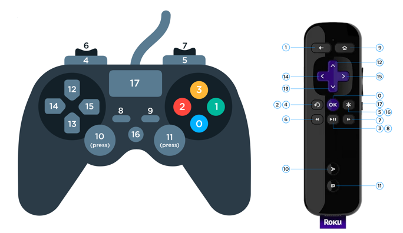

# Remote Control Simulation

The `brs-engine` simulates the Roku remote control, offering customizable mapping and extendable capabilities. The browser libraries support **Keyboard** and **Game Pad** simulation, with the default mapping detailed in the section below. It is also possible to [customize the control buttons mapping](./customization.md#control-mapping) and [enable multi-key support](./customization.md#app-manifest) using a special `manifest` entry.

If you want to create your own control simulation, such as a touch screen control, you can use the [Engine API](./engine-api.md) methods `sendKeyDown`, `sendKeyUp`, and `sendKeyPress`.

The NodeJS `brs.ecp.js` library supports sending commands via the [Roku ECP API](https://developer.roku.com/docs/developer-program/dev-tools/external-control-api.md), which can also be used to simulate remote control for applications [running under the CLI](./run-as-cli.md).

## Keyboard and Game Pad Control Reference

The default mapping of the keyboard and game pads to Roku remote control is described below:

| Keyboard    | Game Pad   | Roku Control | Description                                                           |
|-------------|------------|--------------|-----------------------------------------------------------------------|
| Esc or Del  |     1      |    Back      | Return to the previous screen, some apps will close at the main menu. |
| Home or Shift+Esc|   9   |    Home      | Close the currently loaded app.                                       |
| Arrow Keys  |Joys & D-Pad|    D-Pad     | Directional controls to navigate on menus and control games.          |
| Backspace   |   2 or 4  |    Replay    | Instant replay button.                                                |
| Enter       |     0      |    OK        | Select button.                                                        |
| Insert or Ctrl+8|   5 or 16   |    Info      | Information/Settings button                                       |
| PageUp or Cmd+⬅️|     6      |    Rewind    | Reverse scan button.                                              |
| PageDown or Cmd+➡️|     7      | Fast Forward | Forward scan button.                                            |
| End         |   3 or 8   |  Play/Pause  | Play/Pause button.                                                    |
| Ctrl+A      |    10      |     A        | A game button.                                                        |
| Ctrl+Z      |    11      |     B        | B game button.                                                        |
| F10         |    17      | Volume Mute  | Button to toggle the simulator audio mute on/off.                     |

**Note:** There are mappings not listed above, specific for MacOS or Windows, please look at the file [`src/api/control.ts`](../src/api/control.ts) for details.

